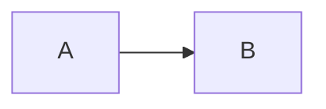

# Policy fixture

A [safe link](https://example.com/a b "Safe") and a
[blocked link](javascript:alert(1)) and an [empty link]().

A [mailto](mailto:x@example.com) and a [tel](tel:+1555) and a
[relative](../docs/guide.md#anchor).

 and .

See [[Wiki Page Name]] and [[Another|labelled]] targets.

<div class="ok"><script>alert(1)</script><em>kept</em></div>

Inline <b onclick="x()">bold</b> raw HTML.

Footnote once[^a] and again[^a], plus another[^b].

[^a]: First footnote body with `code`.
[^b]: Second body.

> [!WARNING]
> Careful with $E=mc^2$ inline math.

```go
package main
```

$$
\sum_{i=1}^n i
$$


